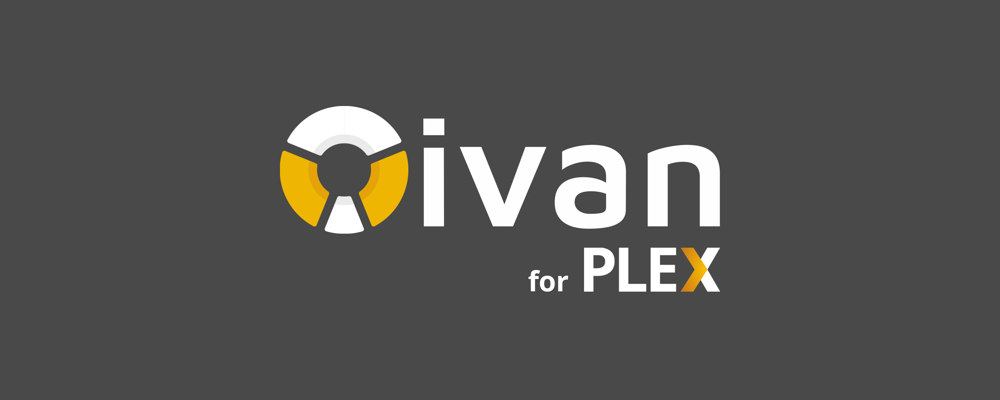

# Tivan

> Browser extension to display stats of your [Plex Media Server (PMS)](https://www.plex.tv/media-server-downloads/) media library.

## Installation from the Web Store

## Contributing

Pull requests are welcome. For major changes, please open an issue first to discuss what you would like to change.

Please make sure to update tests as appropriate.

## Versioning

We use [SemVer](http://semver.org/) for versioning. For the versions available, see the [tags on this repository](https://github.com/nass600/tivan/tags).

## Changelog

See [CHANGELOG](CHANGELOG.md) file for more details.

## License

This project is licensed under the [MIT License](https://opensource.org/licenses/MIT) - see the [LICENSE](LICENSE.md) file for details

## Authors

-   [Ignacio Velazquez](https://ignaciovelazquez.es)
